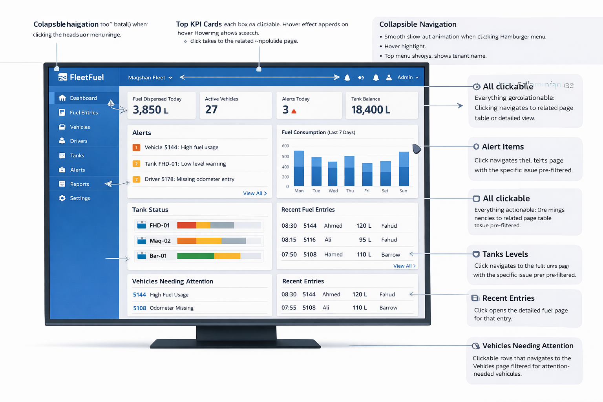

# ADMIN_DASHBOARD

- Status: Draft
- Surface: Admin
- Owner: Designer UI/UX
- Last Updated: 2026-03-04
- Related ADRs: `docs/adr/ADR-0001-multi-tenant-routing.md`
- Related Component Specs:

## Goal

Provide an actionable tenant-scoped command surface where company staff can understand operational status quickly and navigate to the relevant detailed views without dead ends.

## Audience

Company administrators and supervisors monitoring fuel activity, active vehicles, alerts, tank balance, and recent operational exceptions.

## Entry Points

- Navigation source: Primary left navigation, default landing page after admin sign-in
- Deep link source: Tenant-scoped dashboard route
- Permission gate: Authenticated admin roles only

## Layout

- Primary regions:
  - Collapsible left navigation
  - Top bar with tenant name and global actions
  - KPI card row
  - Alerts module
  - Fuel consumption chart
  - Tank status panel
  - Recent entries tables
  - Vehicles needing attention panel
- Responsive behavior:
  - Desktop-first grid with stable card heights
  - Tablet compresses modules before stacking
  - Mobile behavior requires a separate future page spec if the dashboard is exposed there
- Persistent navigation behavior:
  - Left nav collapses with smooth animation and retains icon access

## Data Requirements

- Required API data:
  - Fuel dispensed today
  - Active vehicle count
  - Alerts today
  - Tank balance
  - Alert list
  - Fuel consumption trend
  - Tank status summary
  - Recent fuel entries
  - Vehicles needing attention
- Refresh behavior:
  - Initial load on page entry
  - Manual refresh and future timed refresh may be added later
- Empty data behavior:
  - Show actionable empty states instead of silent zero-value cards when the tenant has not onboarded data

## States

### Loading

- Show full-shell skeletons for nav, KPI cards, modules, and tables
- Preserve final layout height to avoid reflow

### Empty

- If the tenant has no operational data, show onboarding-oriented empty cards with next actions
- If a single module has no data, isolate the empty state to that module

### Error

- If tenant resolution fails, block the page and show a hard-stop error
- If one module fails, preserve the rest of the dashboard and show an in-module retry state

### Success

- Use subtle confirmation only for direct user actions such as refresh or dismissible alerts
- Passive dashboard loads do not need celebratory messaging

## Clickable Areas & Navigation Outcomes

| Area | Interaction | Destination | Expected Outcome |
| --- | --- | --- | --- |
| Left nav item | Click | Tenant-scoped route for that section | Opens the selected section with nav state updated |
| Sidebar collapse control | Click | Current page | Collapses or expands nav with smooth animation |
| KPI card | Click | Related module detail page | Opens the relevant filtered view for that metric |
| Alert list item | Click | Alerts page with pre-applied filters | Opens the specific issue type in a filtered list |
| Alerts module footer action | Click | Alerts page | Opens full alerts view |
| Tank status row | Click | Tanks page with focus on selected tank | Opens detailed tank status context |
| Recent fuel entry row | Click | Fuel entry detail page | Opens the selected entry |
| Vehicles needing attention row | Click | Vehicles page with attention filter | Opens filtered vehicles needing review |
| Fuel consumption chart | Click | Reports or analytics drilldown | Opens the related trend view when available |

## Interaction Rules

- Primary actions:
  - Every major dashboard module must lead to a meaningful destination
- Secondary actions:
  - Footer links and row clicks provide deeper filtered context
- Hover or press behavior:
  - KPI cards and rows show clear hover affordance without excessive motion
- Destructive action behavior:
  - No destructive actions belong on the dashboard shell itself

## Tenant Considerations

- Tenant context is derived from subdomain and shown in the shell header.
- All dashboard data is scoped to the resolved tenant only.
- Empty, loading, and error states must not imply another tenant context or expose mixed-tenant summaries.

## Security Considerations

- Only authorized admin roles may access the page.
- Deep links must preserve tenant context and refuse mismatched tenant access.
- Logs and analytics events must avoid leaking sensitive record details across tenants.

## Instrumentation

- Key events:
  - Dashboard viewed
  - KPI card clicked
  - Alert item clicked
  - Recent entry clicked
- Success metrics:
  - Time to first meaningful action
  - Click-through rate from KPI cards and alerts
- Operational alerts:
  - Dashboard module load failures

## Reference Assets

- Expected image path: `docs/ui/reference/dashboard-reference.png`
- Markdown link example:

```md

```

- Notes for implementers:
  - Use the reference image as directional intent only.
  - The spec is the source of truth for interaction behavior and tenant-safe navigation outcomes.
